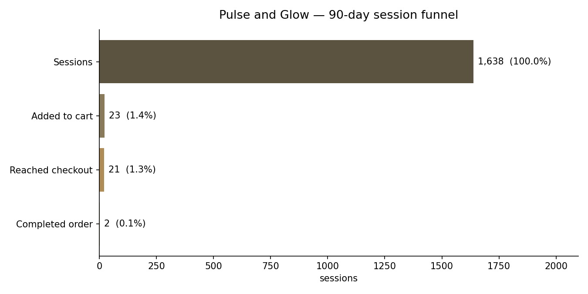
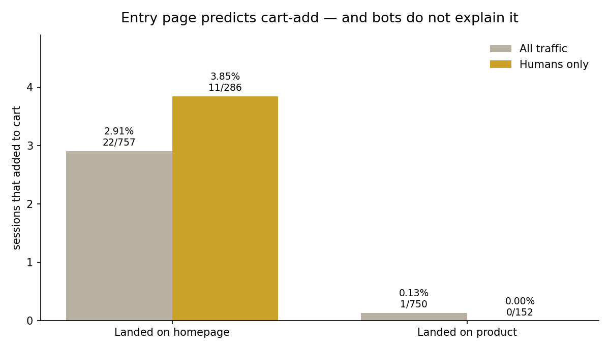
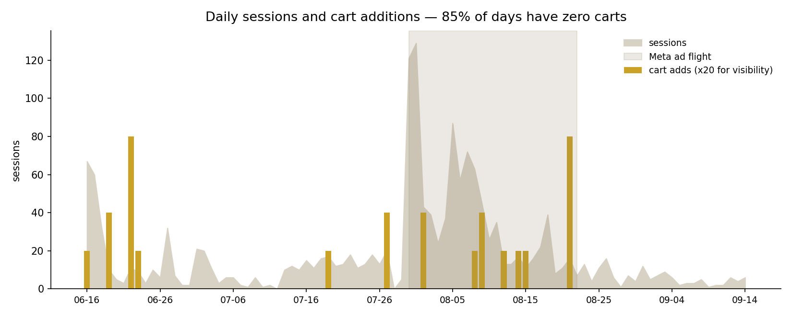

# Where a live Shopify store loses its visitors

**Roy Perez · September 2026**
Repo: [`pulse-glow-funnel-analysis`](https://github.com/royjamesperezflores/pulse-glow-funnel-analysis) · Python · ShopifyQL · SQLite · SQL · matplotlib

---

## Summary

Pulse and Glow is a live Shopify store I run. Over 90 days it took **1,638 sessions** and **2 orders**. I wanted to know where the visitors go.

The answer is early. **1,615 of 1,638 sessions — 98.60% — never added anything to a cart.** Checkout is not the problem; almost nobody reaches it.

The one thing that predicts whether a session ever adds to cart is **the page the visitor entered on**. Device and referrer are indistinguishable noise. Among human visitors, homepage entrants add to cart at **3.85%** and product-page entrants at **0.00%** — zero times in 152 sessions over 90 days (one-tailed Fisher exact, **p = 0.0086**).

Along the way I found that **72% of this store's traffic is bots**, which changes how every other number in the store's reporting should be read.



---

## The data

Shopify's `sessions` dataset, pulled through the Admin GraphQL API with ShopifyQL, into a local SQLite database.

- **Window:** 2026-06-16 → 2026-09-14, 91 daily rows
- **Metrics:** `sessions`, `sessions_with_cart_additions`, `sessions_that_reached_checkout`, `sessions_that_completed_checkout`
- **Dimensions:** landing page type, landing page path, device, referrer, human-or-bot, and one cross-tab
- **Loaded:** 1,502 rows

The repo authenticates on its own — a Dev Dashboard app, the client-credentials grant, a token per run. No manual export anywhere in the chain.

### A constraint that shaped the whole analysis

The four metrics count **sessions in which an event occurred**, independently of one another. They are not a nested cohort. A visitor who adds to cart on Monday and checks out on Thursday lands in two different sessions in two different buckets, with nothing linking them.

You can see this directly in the data: `direct` traffic shows **15 cart-add sessions but 18 checkout-reaching sessions**, and desktop shows 14 against 17.

**So stage-to-stage division is meaningless here and can exceed 100%.** Any "cart → checkout conversion rate" computed from these columns is an artifact. Only "share of all sessions" is a safe ratio, and that is the only ratio this analysis uses. The schema is an aggregate fact table for exactly this reason, not a funnel.

### Verification

Every dimension is a different partition of the same sessions, so all six breakdowns must sum to the same total. **All six sum to exactly 1,638.** A dimension summing short would have meant rows silently lost in transit.

---

## Finding 1 — the entry page predicts everything; device and referrer predict nothing

| Landed on | Sessions | Cart adds | Rate |
|---|---|---|---|
| Homepage | 757 | 22 | **2.91%** |
| Product page | 750 | 1 | **0.13%** |
| Collection page | 32 | 0 | 0.00% |

**22 of the 23 cart additions in 90 days came from sessions that entered on the homepage.**

Two dimensions that looked promising and turned out to be noise:

| Dimension | Split | Cart-add rate |
|---|---|---|
| Device | desktop 944 / mobile 661 | 1.48% vs 1.36% |
| Referrer | direct 1,035 / social 573 | 1.45% vs 1.40% |

Device and referrer are indistinguishable. Entry page is a 20x spread. That contrast is the finding.

### The confound, and the test

Before publishing this I wrote down what could explain it away. The cheapest to test: **bot traffic**. If product pages get scraped more than the homepage, their denominator is inflated and the gap is an artifact of robots, not shoppers.

Shopify's `sessions` dataset has a `human_or_bot_session` dimension, so I crossed it with landing page type.

**The mechanism was real.** Product pages are **79.7% bot** against the homepage's **62.2%**. But removing bots makes the gap **wider**, not narrower:

| Humans only | Sessions | Cart adds | Rate |
|---|---|---|---|
| Homepage | 286 | 11 | **3.85%** |
| Product page | 152 | 0 | **0.00%** |

**One-tailed Fisher exact test: p = 0.0086.** Under the null that entry page does not matter, seeing zero cart additions in 152 product-page human sessions happens less than 1% of the time.

**The single product-page cart addition in the entire window came from a session Shopify flagged as a bot.** Among humans, product-page entrants added to cart zero times in 90 days.



### What this finding does *not* say

Landing page is where a session **entered**, not where the cart addition happened. Homepage entrants may well be browsing to a product page and adding from there. This dataset cannot separate the two.

So the honest claim is about **entry path**, not page quality:

> Visitors who enter through the homepage add to cart. Visitors dropped directly onto a product page do not. Whether that is the product page failing or homepage entrants simply arriving with more intent, this data cannot say.

That is still actionable — it says something specific about where paid traffic is being sent — and it is defensible.

---

## Finding 2 — the ad flight, and a claim I had to walk back

Two Meta campaigns ran **Jul 30 – Aug 21**. They bought the two biggest traffic days in the window:

| Day | Sessions | Cart adds | Orders |
|---|---|---|---|
| 2026-07-31 | 129 | 0 | 0 |
| 2026-07-30 | 121 | 0 | 0 |
| 2026-08-05 | 87 | 0 | 0 |
| 2026-08-07 | 72 | 0 | 0 |

**250 sessions across the window's two highest-traffic days, and not one cart addition.** That much holds.

My first reading was that the ad traffic was worthless. Pooled, it looks that way — the flight's cart-add rate is 1.27% against 1.59% for the rest of the window. **The bot split reverses the sign:**

| Humans only | Days | Sessions | Cart adds | Rate |
|---|---|---|---|---|
| Ad flight | 22 | 300 | 8 | **2.67%** |
| Rest of window | 44 | 154 | 3 | **1.95%** |

Human visitors during the ad flight added to cart at a **higher** rate than humans outside it. With 8 cart additions against 3, that difference is nowhere near significant — the two are indistinguishable at this sample size.

**So the correct statement is weaker than the one I started with.** The ads bought a large volume of traffic that was mostly bots, and the humans they did bring behaved no worse than anyone else. "The ads failed" was a conclusion drawn from a denominator full of robots.



---

## Finding 3 — cart additions are too lumpy to test against

| Day | Sessions | Cart adds | Rate |
|---|---|---|---|
| 2026-06-22 | 11 | 4 | 36.36% |
| 2026-08-21 | 16 | 4 | 25.00% |

**Two days carry 8 of the 23 cart additions — 34.78% of the 90-day total. 78 of 91 days (85.71%) had zero.**

This is the measurement caveat, with numbers attached. Day-to-day variance is larger than any effect a copy or layout change could plausibly produce. A before/after comparison here could not distinguish a real improvement from two good days landing on one side of the split.

---

## Finding 4 — 72% of the traffic is bots

| | Sessions | Share | Cart adds | Rate |
|---|---|---|---|---|
| Bot | 1,184 | 72.3% | 12 | 1.01% |
| Human | 454 | 27.7% | 11 | 2.42% |

**The real human audience is 454 sessions in 90 days — about five people a day.**

Two things here I am reporting rather than smoothing over:

- **Sessions Shopify labels as bots produced 12 of the 23 cart additions and 13 checkout-reaching sessions.** Either the classifier is imperfect or something is scripting cart activity. Neither produced an order.
- **Both orders came from human sessions that entered on the homepage.**

This finding is the one with the widest blast radius. Every session count in this store's advertising reporting has been counting mostly robots.

---

## What I would do, and what I would not claim

**Do:** stop sending paid traffic directly to product pages, and check what a product-page entrant actually sees above the fold.

**Do not claim a lift.** At 454 human sessions in 90 days, with 85% of days at zero cart additions, no on-site change is measurable for effect within this window. The honest deliverable is: ship the change, timestamp it, instrument it, and report the before and after alongside a clear statement of why the sample cannot yet answer the question.

Claiming a measured improvement off two orders would be the fastest way to be wrong in public.

---

## Notes from building it

**A GraphQL server answers HTTP 200 even when your query is malformed.** An early probe script of mine returned `HTTP 200` and was recorded as proof the dataset was reachable. It had two response-shape assumptions wrong and referenced a type that does not exist in the schema. The errors were sitting in the response body the whole time. For GraphQL, the status code is not the check — and the fix is to introspect the schema rather than guess field names.

**ShopifyQL is not SQL.** Its metrics are already aggregates: `SHOW` names which totals you want, and there is no `sum()` to apply. Grouping is `GROUP BY`, not `BY` — a bare `BY` is rejected by the parser, which cost me six of seven pulls in one run.

**Count the rows before designing the analysis.** This project's original question was about the cart-to-purchase drop. Twenty-three carts and two orders cannot carry that question, and finding out on day one is what pointed the whole thing at the pre-cart stage instead.

---

## Running it

```bash
python -m venv .venv && source .venv/bin/activate
pip install -r requirements.txt
cp .env.example .env        # add store, client ID, client secret
python src/pull_sessions.py     # API -> SQLite
python src/analyze_funnel.py    # funnel, breakdowns, significance test
python src/daily_trend.py       # daily series, ad flight, concentration
```
